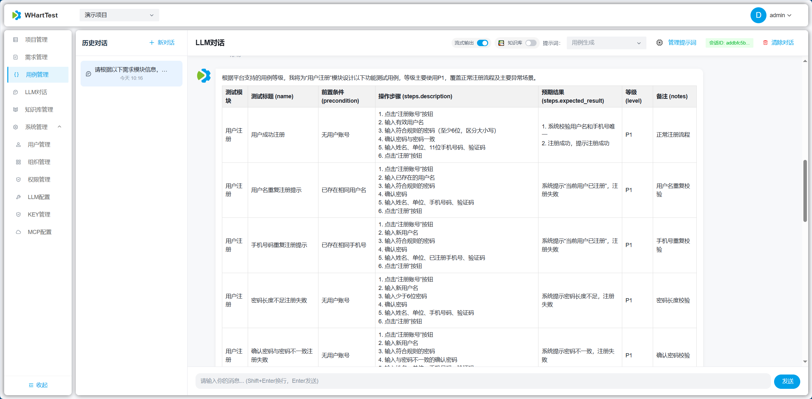
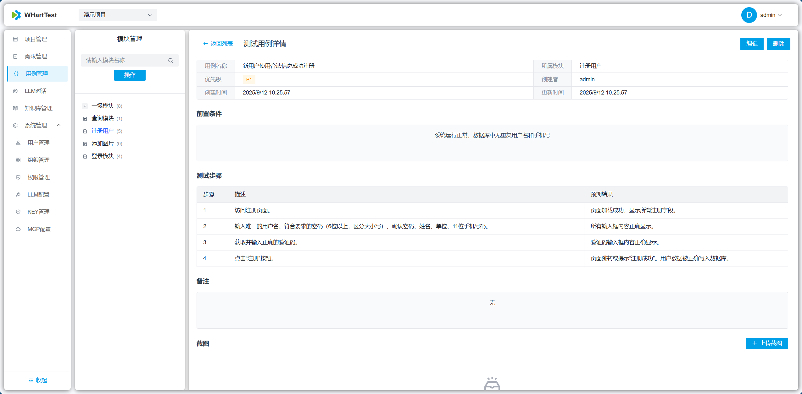
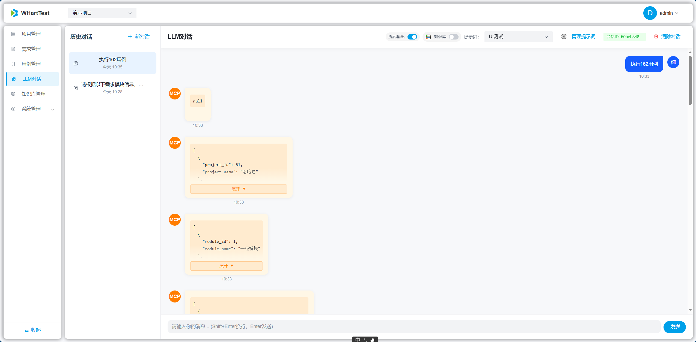
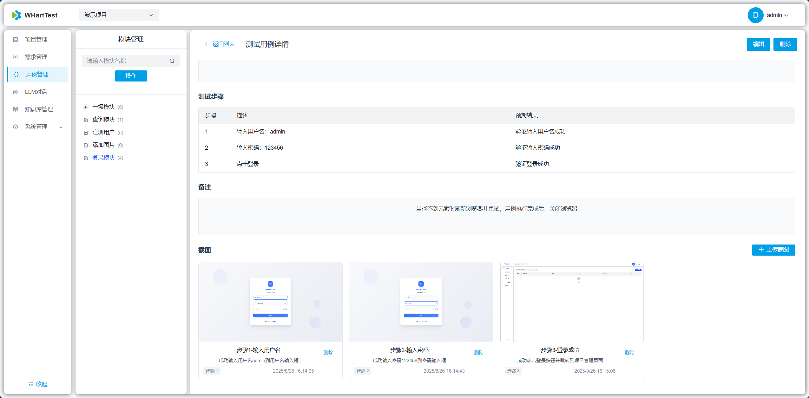
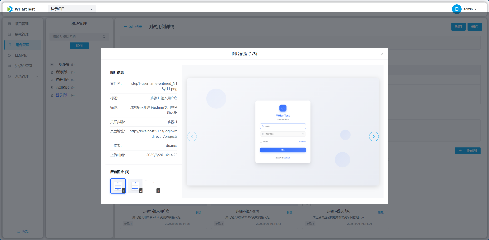
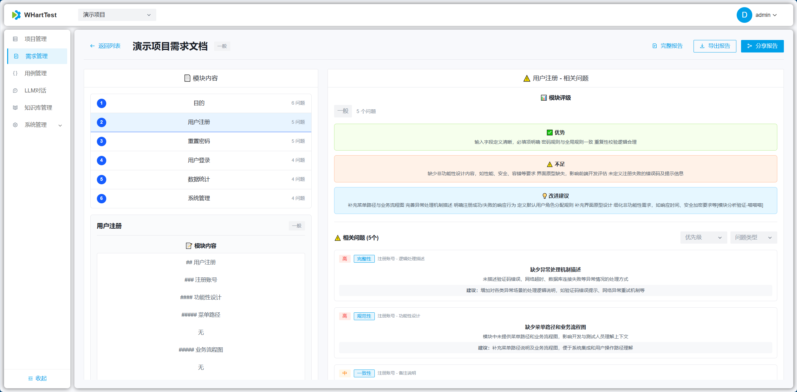

# WHartTest - AI驱动的智能测试用例生成平台

## 项目简介

WHartTest 是一个基于 Django REST Framework 构建的AI驱动测试自动化平台，核心功能是通过AI智能生成测试用例。平台集成了 LangChain、MCP（Model Context Protocol）工具调用、项目管理、需求评审、测试用例管理以及先进的知识库管理和文档理解功能。利用大语言模型和HuggingFace嵌入模型的能力，自动化生成高质量的测试用例，并结合知识库提供更精准的测试辅助，为测试团队提供一个完整的智能测试管理解决方案。

## 🚀 快速部署

### 1. 后端部署文档
[后端部署文档](./WHartTest_Django/README.md)
### 2. 前端部署
[前端部署文档](./WHartTest_Vue/README.md)
### 3. MCP 部署
[MCP 部署文档](./WHartTest_MCP/README.md)
### 4.访问地址
默认地址：http://localhost:5173/
默认账户：admin
默认密码：123456

## 页面展示

| | |
  |---|---|
  |  |  |
  |  |  |
  |  |  |
  |  |  |
  |  |  |
  |  |  |
## 贡献指南

1. Fork 项目
2. 创建功能分支
3. 提交更改
4. 创建 Pull Request

## 联系方式

如有问题或建议，请通过以下方式联系：
- 提交 Issue
- 项目讨论区

---

**WHartTest** - AI驱动测试用例生成，让测试更智能，让开发更高效！
