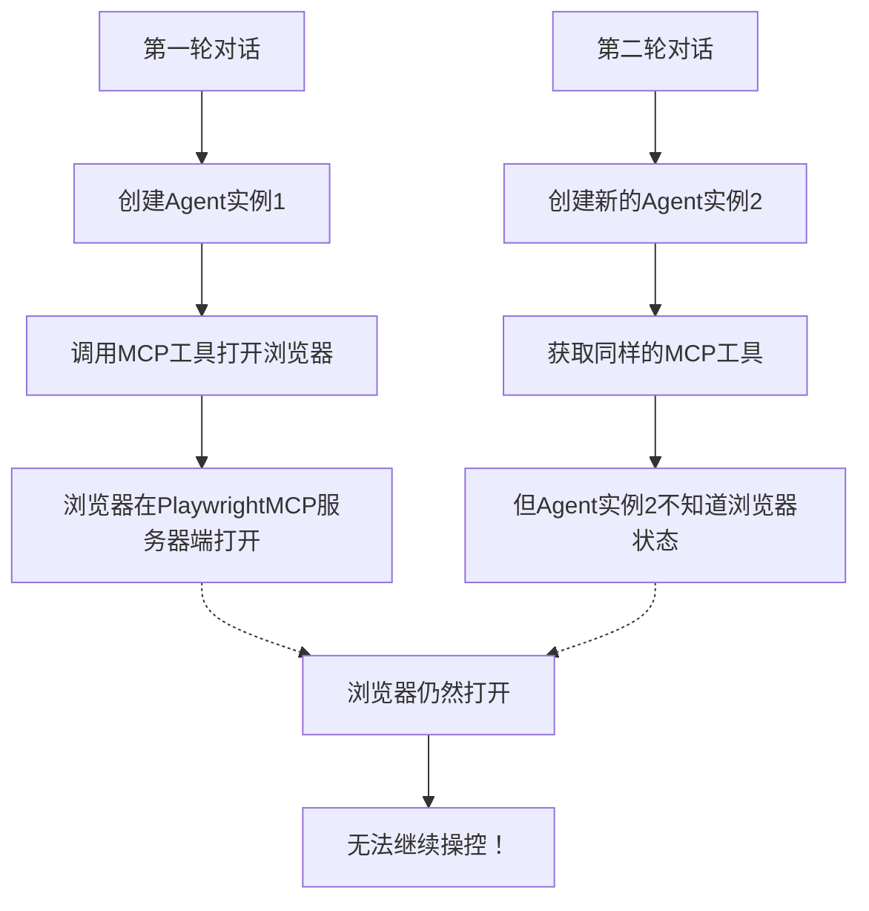

# 跨对话轮次的浏览器状态保持

## 问题描述

在原始实现中，虽然MCP会话是持久的，但存在一个关键问题：

**第一轮对话**：AI通过MCP打开浏览器 ✅
**第二轮对话**：无法继续操控这个浏览器 ❌

## 问题根源

### 1. 架构层面的问题



### 2. 技术细节

- **MCP会话**：全局共享，所有对话轮次使用同一个MCP客户端
- **LangGraph Agent**：每次API调用都重新创建，无状态
- **浏览器状态**：存在于PlaywrightMCP服务器端，但Agent无法感知

## 解决方案

### 1. 增强的会话管理

```python
class GlobalMCPSessionManager:
    def __init__(self):
        self.clients = {}  # config_hash -> PersistentMCPClient
        self.session_contexts = {}  # user_project_key -> session_context
```

### 2. 用户项目级别的会话隔离

```python
async def get_tools_for_config(self, server_configs: Dict[str, Any], 
                               user_id: str = None, project_id: str = None):
    """支持用户和项目级别的会话隔离"""
    # 记录会话上下文
    if user_id and project_id:
        session_key = f"{user_id}_{project_id}"
        self.session_contexts[session_key] = {
            'config_hash': hash(str(sorted(server_configs.items()))),
            'client': client,
            'last_used': asyncio.get_event_loop().time()
        }
```

### 3. 跨对话轮次的状态保持

现在系统会：

1. **记录用户项目的会话上下文**
2. **在同一用户项目的不同对话轮次间共享MCP客户端**
3. **保持浏览器状态的连续性**

## 使用效果

### ✅ 现在可以实现

**第一轮对话**：
```
用户：请帮我打开 https://example.com
AI：好的，我来为您打开网页... [打开浏览器并导航]
```

**第二轮对话**：
```
用户：在页面上找到搜索框并输入"测试"
AI：我来在刚才打开的页面上操作... [在同一浏览器窗口中操作]
```

**第三轮对话**：
```
用户：点击搜索按钮
AI：我来点击搜索按钮... [继续在同一浏览器中操作]
```

## 会话管理

### 查看活跃会话

```bash
python manage.py cleanup_user_mcp_session --list-sessions
```

### 清理特定用户会话

```bash
# 清理特定用户在特定项目的会话
python manage.py cleanup_user_mcp_session --user-id 1 --project-id 2

# 强制清理（不询问确认）
python manage.py cleanup_user_mcp_session --user-id 1 --project-id 2 --force
```

### 清理所有会话

```bash
python manage.py cleanup_mcp_sessions --force
```

## 会话隔离

### 用户级别隔离

- 不同用户的浏览器会话完全独立
- 用户A的操作不会影响用户B的浏览器

### 项目级别隔离

- 同一用户在不同项目中的浏览器会话独立
- 用户在项目A中打开的浏览器不会影响项目B

### 会话标识

会话使用 `{user_id}_{project_id}` 作为唯一标识：

- 用户1在项目2：`1_2`
- 用户3在项目5：`3_5`

## 注意事项

### 1. 资源管理

- 长时间运行的浏览器会话会占用内存
- 建议定期清理不活跃的会话
- 系统会在应用关闭时自动清理所有会话

### 2. 会话超时

- 当前实现没有自动超时机制
- 可以通过管理命令手动清理
- 未来可以考虑添加自动超时清理

### 3. 并发安全

- 使用异步锁确保并发安全
- 多个请求同时访问同一会话时会正确排队

## 技术实现

### 核心改动

1. **GlobalMCPSessionManager** 增加 `session_contexts` 字典
2. **get_tools_for_config** 方法支持用户项目参数
3. **LangGraph集成** 传递用户和项目信息
4. **管理命令** 支持精细化的会话清理

### 向后兼容

- 不传递用户项目信息时，系统仍然正常工作
- 现有的全局清理机制保持不变
- API接口无破坏性变更

这个解决方案彻底解决了跨对话轮次的浏览器状态保持问题！🎉
