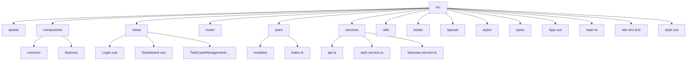

# 项目初始架构与技术选型规划

## 1. 技术栈确认与建议

根据您提供的项目文件和目标，当前的技术栈选择是合适的，并且具有良好的开发效率和可维护性：

*   **Vue 3:** 作为核心前端框架，Vue 3 提供了优秀的性能、组合式 API (Composition API) 以及更好的 TypeScript 支持，非常适合构建现代化的 Web 应用。
*   **Vite:** 作为构建工具，Vite 提供了极速的冷启动和热模块替换 (HMR)，能够显著提升开发体验。
*   **TypeScript:** 通过静态类型检查，TypeScript 可以帮助在开发阶段捕获更多错误，提高代码质量和可维护性，特别适合团队协作和大型项目。
*   **Tailwind CSS:** 作为一个原子化 CSS 框架，Tailwind CSS 提供了高度的灵活性和可定制性，能够快速构建用户界面，并且易于维护。从 `package.json` 中可以看到 `tailwindcss`, `@tailwindcss/postcss`, `autoprefixer`, `postcss` 已经作为开发依赖存在，说明项目已经具备了使用 Tailwind CSS 的基础。
*   **Pinia:** (`package.json` 中已引入) 作为 Vue 3 的官方状态管理库，Pinia 提供了简洁易用的 API 和良好的 TypeScript 支持，非常适合管理应用的状态。
*   **Arco Design Vue:** (`package.json` 中已引入) 这是一个优秀的企业级 UI 组件库，提供了丰富的预设组件，可以加速前端页面的开发，特别是对于管理后台这类应用。
*   **@vueuse/core:** (`package.json` 中已引入) 这是一个包含大量实用 Vue Composition API 函数的集合，可以简化很多常见功能的实现，例如事件监听、状态同步等。

**建议：**

*   **保持当前技术栈：** 目前的技术栈组合非常现代且高效，建议继续沿用。
*   **充分利用已有库：** 既然已经引入了 Pinia 和 Arco Design Vue，后续开发应充分利用它们提供的能力。

## 2. 目录结构规划

一个清晰的目录结构对于项目的可维护性和扩展性至关重要。建议在 `src` 目录下组织如下结构：

*   **`assets/`**: 存放静态资源，如图片、字体等。
*   **`components/`**: 存放可复用的 UI 组件。
    *   **`common/`**: 存放全局通用的基础组件。
    *   **`features/`**: 存放与特定业务功能相关的组件。
*   **`views/`** (或 `pages/`): 存放页面级组件。
*   **`router/`**: 存放路由配置。
*   **`store/`**: 存放 Pinia 状态管理相关的模块。
    *   **`modules/`**: 按功能模块划分 store。
    *   **`index.ts`**: 导出所有 store 模块或创建根 store。
*   **`services/`**: 存放与后端 API 交互的逻辑。
    *   **`api.ts`**: 配置 HTTP 客户端实例。
    *   **`auth.service.ts`**: 处理用户认证相关的 API 请求。
    *   **`testcase.service.ts`**: 处理测试用例相关的 API 请求。
*   **`utils/`**: 存放通用的工具函数。
*   **`hooks/`**: 存放自定义的 Vue Composition API Hooks。
*   **`layouts/`**: 存放页面布局组件。
*   **`styles/`**: 存放全局样式文件、Tailwind CSS 自定义配置等。
*   **`types/`**: 存放 TypeScript 的类型定义文件。
*   `App.vue`: 根组件。
*   `main.ts`: 应用入口文件。
*   `vite-env.d.ts`: Vite 环境变量的 TypeScript 类型定义。

## 3. 核心依赖库建议

除了 `package.json` 中已有的依赖，以下是一些核心功能的建议：

*   **路由管理:**
    *   **`vue-router`**: Vue 官方的路由管理器。安装：`npm install vue-router@4`。
*   **HTTP 客户端:**
    *   **`axios`**: 基于 Promise 的 HTTP 客户端。安装：`npm install axios`。
    *   或者，基于浏览器原生的 `fetch` API 进行封装。
*   **表单校验:**
    *   `VeeValidate` 或 `FormKit` (可选，Arco Design Vue 自带校验功能)。
*   **日期处理:**
    *   `dayjs` 或 `date-fns` (可选，按需引入)。

## 4. 开发流程建议

1.  **需求分析与设计**
2.  **任务拆分**
3.  **接口定义** (与后端协作)
4.  **前端开发** (组件、页面、逻辑、测试)
5.  **代码审查**
6.  **集成测试**
7.  **构建与部署**
8.  **监控与反馈**

## 5. 登录模块对接 Django 的初步考虑

*   **认证机制:** 通常基于 Token (如 JWT) 或 Session。前端获取并存储 Token。
*   **API 请求:**
    *   调用登录 API。
    *   后续请求携带 Token。
    *   登出 API 及 Token 刷新。
*   **路由守卫:** Vue Router 导航守卫实现权限控制。
*   **错误处理:** 处理登录失败及认证失败。