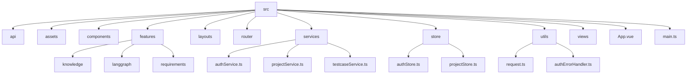

# 前端架构 (WHartTest_Vue)

前端项目基于 Vue 3 生态系统构建，采用 TypeScript 提供类型安全，Vite 作为构建工具以提升开发效率，旨在提供一个现代化、响应式且易于维护的用户界面。

## 1.1. 技术选型

| 类别 | 技术 | 说明 |
| :--- | :--- | :--- |
| **核心框架** | Vue 3 | 采用组合式 API (Composition API) 进行开发，提升代码组织和复用性。 |
| **构建工具** | Vite | 提供极速的开发服务器启动和热模块更新 (HMR)。 |
| **编程语言** | TypeScript | 为项目提供静态类型检查，增强代码健壮性和可维护性。 |
| **UI 组件库** | Arco Design Vue | 提供丰富、高质量的企业级组件，加速界面开发。 |
| **状态管理** | Pinia | Vue 官方推荐的状态管理库，提供类型安全、简洁易用的 API。 |
| **路由管理** | Vue Router | 官方路由管理器，用于构建单页应用 (SPA)。 |
| **HTTP 客户端** | Axios | 用于与后端 API 进行通信，并通过拦截器实现统一的请求/响应处理。 |
| **CSS 方案** | Tailwind CSS | 原子化 CSS 框架，提供高度的灵活性和可定制性。 |

## 1.2. 目录结构

前端代码结构清晰，遵循功能模块化的组织方式，核心代码位于 `src` 目录下：

- **`api/`**: 存放与具体业务无关的底层 API 客户端配置。
- **`assets/`**: 存放静态资源，如图片、字体和全局样式。
- **`components/`**: 存放全局可复用的 UI 组件，如权限选择器、成员表格等。
- **`features/`**: **核心业务目录**，按功能领域划分模块（如 `knowledge`, `langgraph`），每个模块内部包含自己的组件、服务、类型定义和视图。
- **`layouts/`**: 存放页面布局组件，如包含顶部导航和侧边栏的 `MainLayout.vue`。
- **`router/`**: 定义应用的路由规则和导航守卫，实现页面跳转和权限控制。
- **`services/`**: 存放与后端 API 交互的服务层，封装了具体的业务请求逻辑。
- **`store/`**: 使用 Pinia 进行状态管理，如 `authStore` 管理用户认证状态，`projectStore` 管理项目状态。
- **`utils/`**: 存放通用工具函数，如 `request.ts` 中封装的 Axios 实例和拦截器。
- **`views/`**: 存放顶层的页面级组件，通常由路由直接渲染。

## 1.3. 核心机制

- **API 请求与封装**: 在 `utils/request.ts` 中，Axios 被封装用于所有后端请求。
  - **请求拦截器**: 自动为每个请求附加 JWT `Authorization` 头。
  - **响应拦截器**: 统一处理后端返回的数据结构，并实现了 **Token 自动刷新机制**。当检测到 401 未授权错误时，会尝试使用 `refreshToken` 获取新的 `accessToken` 并自动重试失败的请求，对用户透明。
- **状态管理**: Pinia 负责全局状态管理。
  - `authStore`: 管理用户的认证凭证（Token）、个人信息和登录状态，并与 `localStorage` 同步，实现持久化登录。
  - `projectStore`: 管理当前选中的项目及其列表，确保在不同页面间共享统一的项目上下文。
- **路由与权限**: `router/index.ts` 中定义的导航守卫 (`router.beforeEach`) 负责页面级的权限控制。它会检查用户的登录状态 (`isAuthenticated`) 和目标路由的 `meta.requiresAuth` 字段，未登录的用户访问受保护页面时将被重定向到登录页。